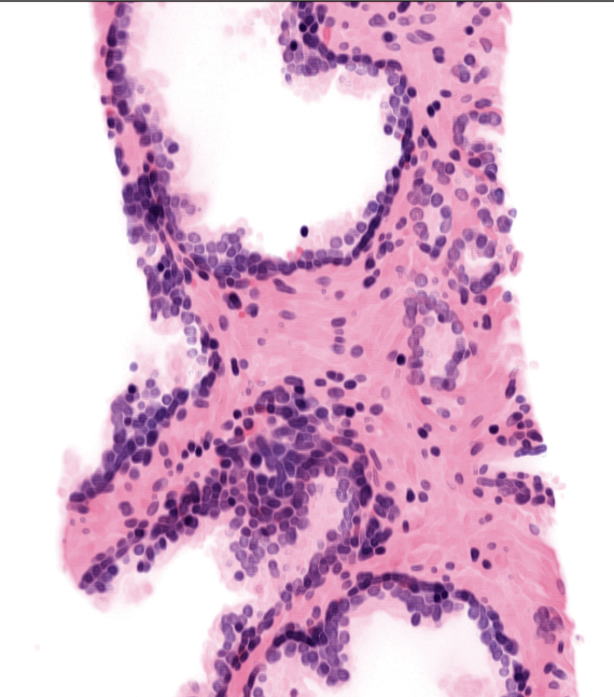

# Patho_grading_GUI

CSE583 Project (AUT 2023) (zexyang_testing)
Try the merge

CSE583 Project (AUT 2023) 


## System requirements
The following packages are required, many of which come with Python. This code has been tested with the version number indicated, though other versions may also work.
- numpy 1.23.3
- pandas 1.4.4
- matplotlib 3.5.3
- seaborn 0.12.2
- scikit-learn 1.1.3
- scipy 1.9.3


## Data
Number of biopsy (filtered) : 145

Number of patients (filtered) : 52



## Run example:

```bash
python GUI.py 2D
```


