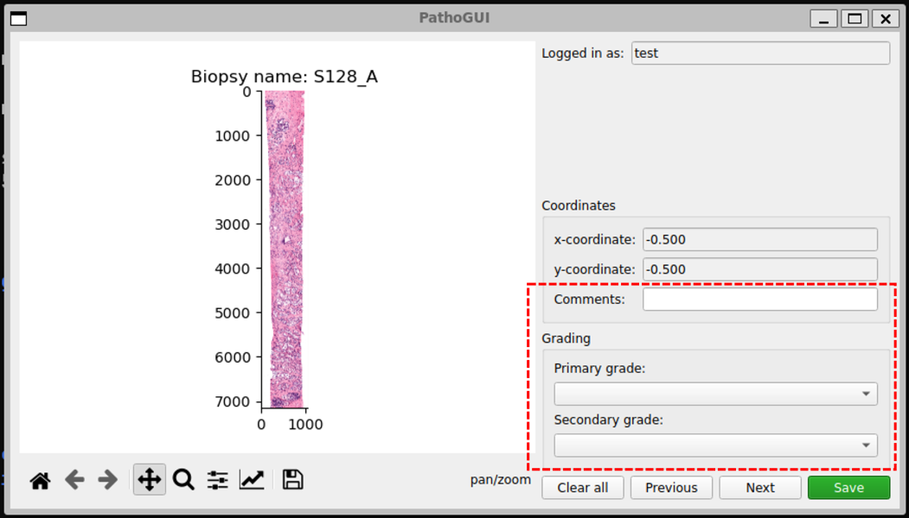

# Example for Pathology Grading GUI
This document illustrates how to use Pathology Grading software. Installation guide can be found in *installation_guide.md* in this folder. To start the software, run *'python GUI_pyqt5.py'*

## Login
1) Login page shows up

2) Create new user account (First login)

3) Create new user sucessful

4) Login

5) GUI home page shows up

## Grading 
6) Grading by fill out comment in comment box (1), select primary and secondary grade in drop down (2) & (3)

### Navigation Toolbar

#### Zoom Tool
7) User can zoom in by using zooming tool (1). Then, select area of interest (2).

8) After release mouse, the canvas will be zoomed in. Note that x-coordinate and y-coordinate has changed.

#### Adjust Canvas Alignment

9) User can set alignment of canvas (1). Adjust position of borders and spacing when window pop-up (2). Click *tight layout* for auto adjustment or *reset* to reset canvas alignment.

#### Adjust x-coordination and y-coordination

10) User can set x-coordination and y-coordination of the canvas (1) on pop-up window (2)

#### Save canvas

11) User can save current canvas to image file (1). Select destination folder (2).

### Saving grading input

12) Click *save* button to save ...
- coordinate of current canvas position
- comments
- primary and secondary grade

13) Inspect csv output by navigating to result folder

14) Check output result in *Grading_result_[your_username]*

### Clear grading input

15) Click *Clear all* button to clear all input (comment textbox, primary, and secondary grade)

16) All input are cleared. Note that this only clear input in current GUI, but does not delete input that being save in csv file.

